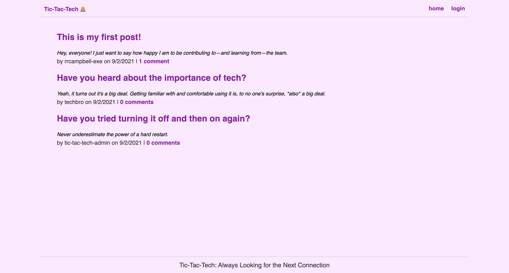

# Tic-Tac-Tech

## Description
A full-stack  CMS-style blog site for the creation, reading, updating, and deleting of articles, blog posts, thoughts, and opinions.

## Table of Contents
- [Usage](#usage)
- [Credits](#credits)
- [License](#license)
- [Features](#features)
- [Questions, Comments, Suggestions](#questions-comments-suggestions)

## Screenshot

## Usage
When first visiting the site at [https://tic-tac-tech-blog-site.herokuapp.com/](https://tic-tac-tech-blog-site.herokuapp.com/), you'll be able to read posts from the home page. To see an individual post's comments, you can click the comment link on beneath each post. 

To log in and add comments or posts of your own, click "login" in the upper-right-hand corner of the page and either provide your login credentials or create an account by following the steps provided. 

Once logged in, you'll be routed to your personal dashboard, where you can create a new post, view your post history, or edit past posts by clicking the edit post link beneath each post.

 ## Features
 - For a full list of features, please visit the project's package.json file and view its dependencies.

## License
This application is covered under the MIT license.

## Credits
### Developed By
- [Ryan R. Campbell](https://www.github.com/rrcampbell-exe/)

### With Additional Credit To
- Routes and CSS based on 2U instructional modules 13 and 14, namely "Object Relational Mapping (ORM)" and "Model-View Controller (MVC)

## Questions, Comments, Suggestions
Please email [Ryan R. Campbell](mailto:campbell.ryan.r@gmail.com) with any questions, to report any bugs, or to make any feature suggestions. You can also [contact Ryan R. Campbell on GitHub](https://www.github.com/rrcampbell-exe/).

This README was generated by [Ryan R. Campbell's](https://www.github.com/rrcampbell-exe/) [README Generator](https://github.com/rrcampbell-exe/readme-generator).